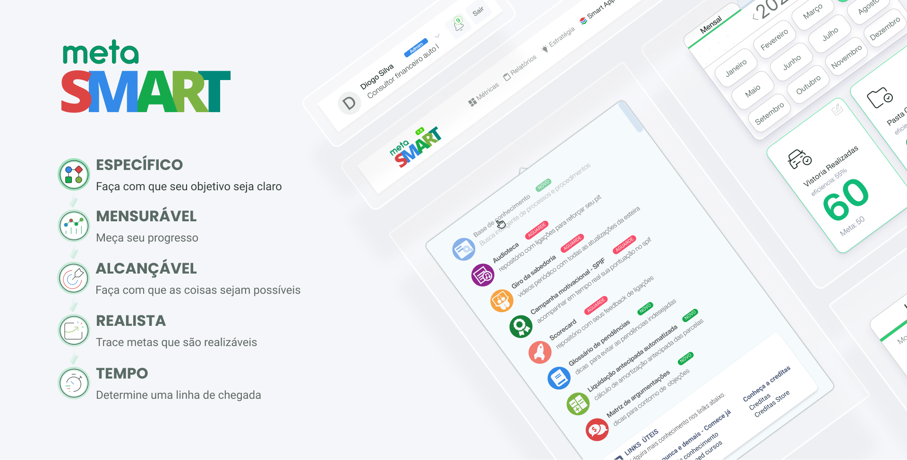
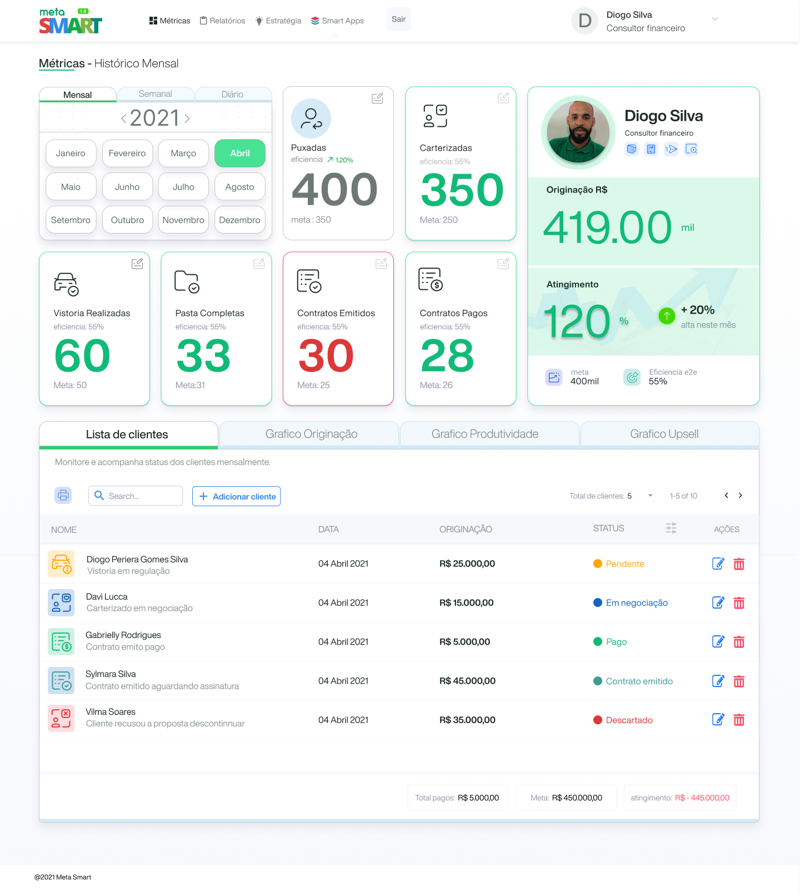
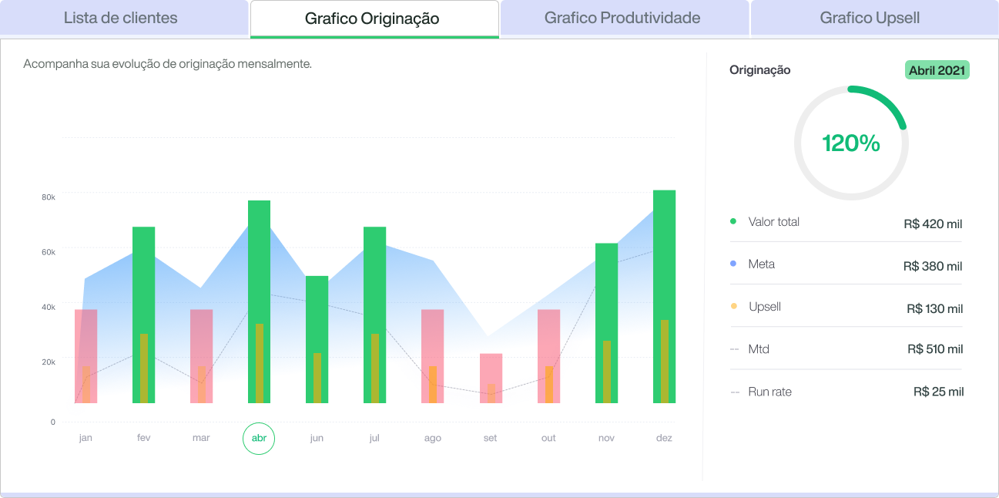
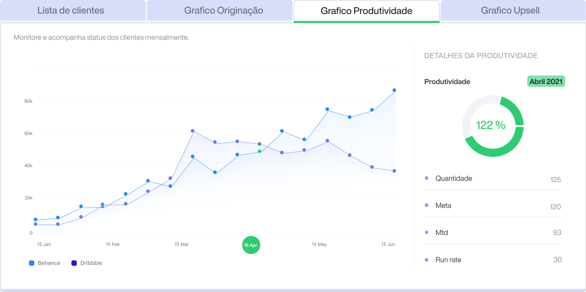
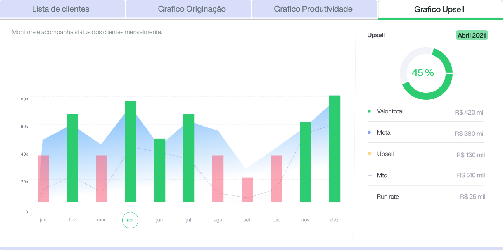
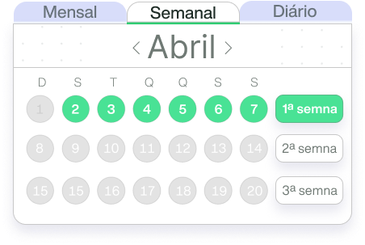
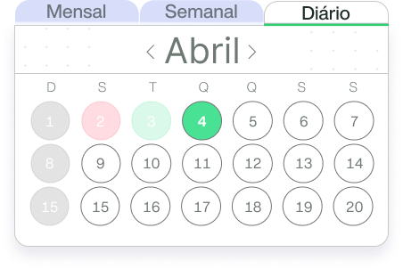
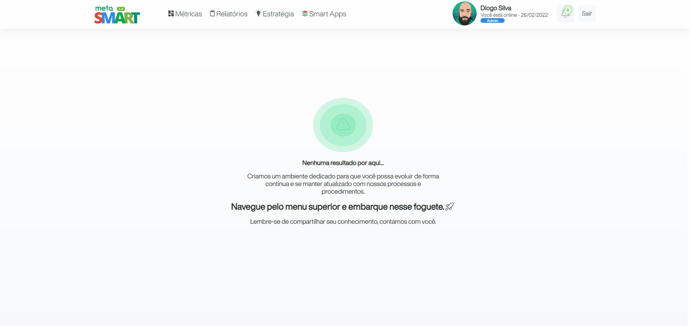
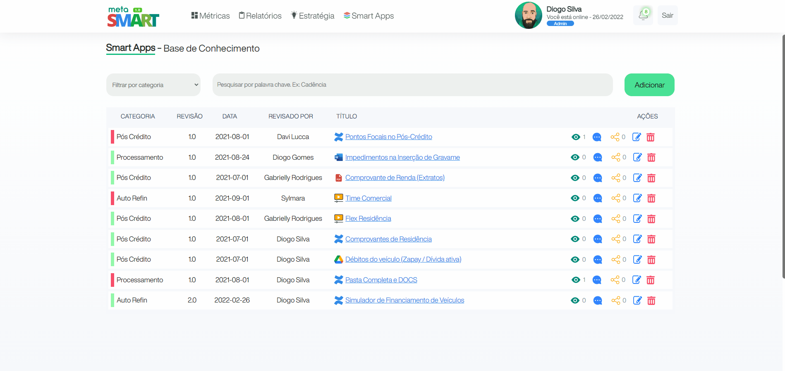
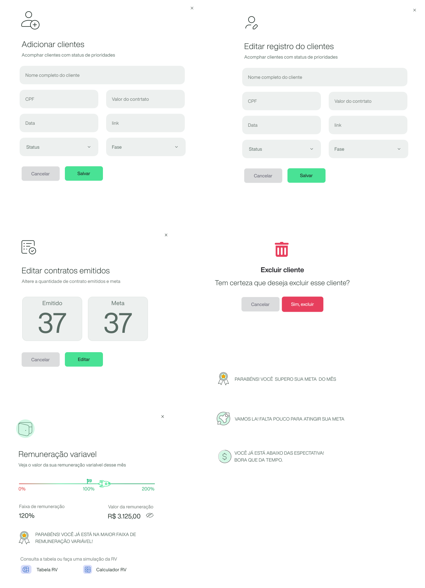

<!-- Logotipo -->
<div align="center">
  
</div>

<!-- Subtitle -->
<h2 align="center"> Meta Smart v 01</h2>

<!-- Badges -->
<p align="center">
 <a>
  
  
  
  </a>
</p>

<!-- Sobre o Projeto -->

## 🚀 Sobre o Meta Smart

Centralize todos os processos, procedimentos e ferramentas em um só lugar com o Meta Smart as equipes tomam decisões mais rápidas, ficando sincronizadas trazendo mais resultado com mais transparência.

Meta Smart é uma plataforma onde auxilia uma equipe que depende de metas e resultados ter uma visão geral de todo o fluxo e processo da empresa.
Com ferramentas personalizadas que se adequa a qualquer equipe de vendas,
trazendo mais transparecia e clareza em todo o ciclo da venda.

## Projeto

<div align="center">
  
</div>

## Métricas

Ferramentas como dashboards com visão detalhada das métricas mensais, semanais, diárias e com gráficos dinâmicos com informações gerais do resultado individual ou por equipe. Controle de clientes com status personalizados para gerenciar todo o clico de venda.

Relatórios de produtividade mensal, semanal e diários possibilitando criar estratégias pontuais individuais ou para equipe.

<div align="center">
  
  
  
  
  
  
</div>

## Smart App - Base de Conhecimento

Smart Apps uma central de ferramentas personalizada onde proporcionam um espaço ideal para sua equipe criar, coletar e colaborar em qualquer projeto ou ideia, centralizando em um único local todas as informações necessárias para realizar o melhor trabalho.

A ideia e que cada APP possa ajudar sua equipe a estruturar, organizar e compartilhar o trabalho, para que cada membro da equipe possa ver o conhecimento institucional e acessar as informações necessárias para realizar um melhor trabalho.

Conta com um repositório de links de processo e procedimentos com controle de versionamento e central de comentários onde a interação dos colaboradores passo pontuar falhas no processo para que assim seja corrigido trazendo mais agilidade na atualização dos processos e procedimento dessa forma o processo sempre vai estar mais atualizado evitando transtorno com informações desatualizadas.

<div align="center">
  
  
  
</div>

## Components

<div align="center">
  
</div>

## ⚙️ Funcionalidades

- Login:

  - [x] Conta do google
  - [ ] Criar conta sem vínculo
  - [ ] Recuperar Senha

- Métricas:

  - [ ] Histórico diário
  - [ ] Histórico mensal
  - [ ] Histórico detalhado

- Relatórios:

  - [ ] produtividade diário
  - [ ] produtividade mensal
  - [ ] produtividade detalhado

- Estratégia:

  - [ ] personalizar estratégias para metas

- Smart Apps:
  - [x] Base de conhecimento
  - [ ] Audioteca
  - [ ] Videoteca
  - [ ] Scorecard feedbacks
  - [ ] Top Performance

## 🧰 Tecnologias e Bibliotecas

- [Nextjs](https://nextjs.org/)
  - [Styled Component](https://www.npmjs.com/package/styled-components) - Biblioteca CSS in JS
  - [firebase](https://firebase.google.com)
  - [TypeScript](https://www.typescriptlang.org/)

## ⚙️ Rodando o Projeto

```bash
# Clone este repositório para a pasta anterior
$ git clone https://github.com/diogomfc/proj-meta-smart.git
# ou use a opção de download.

# Acesse a pasta proj-meta-smart
$ cd proj-meta-smart

# Instale as dependências
$ yarn install
ou
$ npm install

# Executando o Projeto
$ yarn dev
ou
$ npm dev

# Acesse http://localhost:3000 no seu navagador
```

## Preview

https://metasmart-dev.vercel.app

<div align="center">
  <small>Diogo Silva - 2021</small>
</div>
